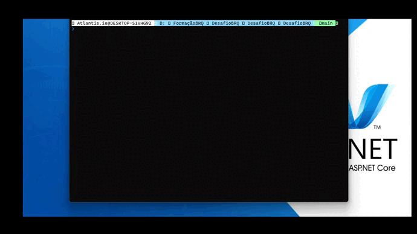

# [EduSync] Turma Lítio - (ENTRYPOINT .NET - BRQ)
<br><br>
# Desafio IMC
[](https://github.com/rfagner/DesafioBRQ/blob/main/LICENSE) <br><br>


<br><br>


<br><br>

# Sobre o projeto

O Programa de Emagrecimento Saudável é uma aplicação de console construída durante o desafio da 1ª Fase do **Programa ENTRYPOINT .NET**, evento realizado pela:<br> [BRQ] (https://digital.brq.com/formacao-entry-point) <br><br><br>

A aplicação consiste em gerar um diagnóstico prévio para o programa de
emagrecimento, conforme exemplo abaixo:<br><br>
<p align="center">
    
</p> <br><br>

# O que é o IMC?<br>
O IMC é reconhecido como padrão internacional para avaliar o grau de sobrepeso e
obesidade.<br><br>
É calculado dividindo o peso (em kg) pela altura ao quadrado (em metros).<br><br>
IMC = Peso ÷ (Altura × Altura)<br><br><br>


# Informações importantes

Para criar o Diagnóstico Prévio siga as orientações abaixo:<br><br>
Cálculo IMC:<br><br>
IMC = Peso ÷ (Altura ²)<br><br><br>

# Tecnologias usadas
- .NET 5<br><br>

# Como executar o projeto

Pré-requisitos: .NET 5

```bash
# clonar repositório
git clone https://github.com/rfagner/DesafioBRQ

# entrar na pasta do projeto DesafioBRQ
cd DesafioBRQ

# executar o projeto
dotnet run

``` 
<br><br>
# Autor

Renildo Fagner dos Santos de Assis

https://www.linkedin.com/in/rfagner/
